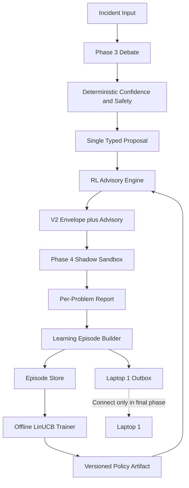

# Phase 3–4 RL Advisory Engine: Final Implementation Plan

Version: 1.0  
Repository: `Sr-2006/Debate-and-Sandbox`  
Base branch: `final`  
Required base commit: `8f68a7b10e3fa0fcd388e3200d6b1c3e1621f164`  
Scope: Recommendation-only RL integration for Phase 3 and Phase 4  
Laptop 1 connection: Explicitly deferred to the final implementation phase

---

## 1. Final architectural decision

Implement a **Safe Contextual-Bandit Advisory Engine**, not an autonomous remediation policy.

The RL advisor receives the single typed intent already selected by Phase 3 and recommends exactly one routing action:

1. `ACCEPT_PROPOSAL`
2. `OBSERVE_FIRST`
3. `REQUIRE_HUMAN_REVIEW`
4. `ABSTAIN`

The advisor does not invent or rewrite capabilities. This avoids redesigning the working Phase 3 orchestrator and the Phase 3 → Phase 4 contract.

The first release operates in `SHADOW` mode:

- The recommendation is calculated and reported.
- Phase 3 and Phase 4 behavior remains unchanged.
- Phase 4 outcomes are collected as learning episodes.
- The advisor cannot affect execution.

After the promotion gates pass, enable `ADVISORY` mode:

- `ACCEPT_PROPOSAL`: no routing change.
- `OBSERVE_FIRST`: may downgrade a mutative proposal to the existing Phase 4 read-only observation route.
- `REQUIRE_HUMAN_REVIEW`: may add a human-review requirement.
- `ABSTAIN`: may prevent Phase 4 mutation and return an advisory abstention outcome.

The advisor must be **monotonic-safe**:

- It may preserve or reduce execution authority.
- It may never increase confidence.
- It may never remove a safety violation.
- It may never bypass human approval.
- It may never convert an unsupported or unmapped action into a supported action.
- It may never change `READ_ONLY_OBSERVED`, `NO_SUPPORTED_ACTION`, `UNSUPPORTED_IN_MVP`, or `PHASE3_FAILED` into an executable action.
- Phase 4 contract validation, attestation, before-state, verification, and rollback remain authoritative.

---

## 2. Why this is the correct MVP RL methodology

The repository currently has only 22 designed problem cases, and CI primarily uses explicit simulation. That is insufficient for a trustworthy deep-RL policy.

The repository already contains:

- A typed capability catalog.
- A deterministic Phase 3 confidence scorer.
- Phase 4 verified outcome reporting.
- SQLite `outcome_history`.
- A Beta-posterior `ConfidenceAnalyzer`.

Reuse these foundations and add the smallest defensible RL layer:

### Layer A — Bayesian execution evidence

Use the existing Beta posterior per `capability × target_kind`.

Purpose:

- Provide cold-start execution evidence.
- Expose sample size and a conservative lower bound.
- Never call this value “RL confidence.”
- Keep it separate from deterministic diagnosis confidence.

### Layer B — Safe contextual bandit

Use **disjoint LinUCB** over the four routing actions.

Why LinUCB:

- Small and explainable.
- Works with limited tabular context.
- Fast enough for a laptop.
- Supports uncertainty-aware exploration.
- Can be serialized as JSON-compatible matrices.
- Uses NumPy, which is already installed.
- Does not require a new deep-learning stack.
- Produces a score breakdown that can be reported and visualized.

The bandit predicts the expected safety-adjusted utility of each routing action. A deterministic safety mask removes impossible actions before selection.

Do not introduce DQN, PPO, policy gradients, neural networks, Ray RLlib, or online exploration in this implementation.

---

## 3. Final end-to-end architecture



---

## 4. Repository structure to add

Create exactly this structure:

```text
rl_engine/
  __init__.py
  config.py
  contracts.py
  feature_extractor.py
  safety_mask.py
  bayesian_prior.py
  policy.py
  advisor.py
  reward.py
  episode_builder.py
  episode_store.py
  trainer.py
  evaluator.py
  model_store.py
  cli.py
  models/
    .gitkeep
  outbox/
    .gitkeep
  tests/
    __init__.py
    test_contracts.py
    test_features.py
    test_safety_mask.py
    test_policy.py
    test_advisor.py
    test_reward.py
    test_episode_builder.py
    test_episode_store.py
    test_trainer.py
    test_evaluator.py
    test_integration_phase3_phase4.py
    test_laptop1_outbox.py

contracts/
  rl_advisory_v1.schema.json
  learning_episode_v1.schema.json
```

Modify only these existing files:

```text
run_mvp_pipeline.py
contracts/action_proposed_v2.schema.json
contracts/models.py
debate/action_publisher.py
Arse_shadow/shadow_sandbox/persistence.py
Arse_shadow/shadow_sandbox/reports/report_generator.py
tests/test_mvp_unit.py
tests/test_mvp_e2e.py
.github/workflows/mvp.yml
.gitignore
```

Do not modify:

- Agent prompts.
- Phase 3 deterministic scoring weights.
- Existing confidence thresholds.
- Phase 4 executor implementations.
- Capability registry behavior.
- Target attestation.
- Verification or rollback logic.
- Existing terminal outcome meanings.

---

## 5. Contracts

## 5.1 RL advisory contract

Add `contracts/rl_advisory_v1.schema.json`.

Required logical structure:

```json
{
  "schema_version": "1.0",
  "advisory_id": "adv_<uuid>",
  "incident_id": "case_11",
  "run_id": "run_<timestamp>",
  "created_at": "UTC ISO-8601",
  "policy": {
    "policy_name": "safe_disjoint_linucb",
    "policy_version": "rl-mvp-1",
    "model_version": "cold-start",
    "operating_mode": "SHADOW"
  },
  "proposal": {
    "intent_type": "postgres.setting.update",
    "target_kind": "database",
    "mode": "MUTATE_REVERSIBLE",
    "risk_class": "MEDIUM"
  },
  "recommendation": "OBSERVE_FIRST",
  "action_scores": {
    "ACCEPT_PROPOSAL": 0.21,
    "OBSERVE_FIRST": 0.62,
    "REQUIRE_HUMAN_REVIEW": 0.44,
    "ABSTAIN": 0.30
  },
  "estimated_success_probability": 0.41,
  "uncertainty": 0.39,
  "sample_size": 3,
  "cold_start": true,
  "influence_allowed": false,
  "reason_codes": [
    "RL_COLD_START",
    "INSUFFICIENT_REAL_OUTCOMES"
  ],
  "feature_schema_version": "features-v1",
  "feature_hash": "sha256",
  "latency_ms": 2
}
```

Allowed recommendations must be an enum of the four routing actions.

`estimated_success_probability` must be nullable. Do not fabricate it when the model is unavailable or the context is unsupported.

## 5.2 Learning episode contract

Add `contracts/learning_episode_v1.schema.json`.

Required logical structure:

```json
{
  "schema_version": "1.0",
  "episode_id": "ep_<uuid>",
  "incident_id": "case_11",
  "run_id": "run_<timestamp>",
  "payload_hash": "canonical hash",
  "created_at": "UTC ISO-8601",
  "context": {
    "feature_schema_version": "features-v1",
    "features": {},
    "feature_vector": [],
    "feature_hash": "sha256"
  },
  "proposal": {
    "intent_type": "postgres.setting.update",
    "target_kind": "database",
    "mode": "MUTATE_REVERSIBLE",
    "risk_class": "MEDIUM"
  },
  "advisory": {},
  "phase4": {
    "status": "SIMULATION_VERIFIED",
    "simulated": true,
    "attested": true,
    "execution_success": true,
    "verification_passed": true,
    "rollback_attempted": false,
    "rollback_confirmed": false
  },
  "learning": {
    "eligible": false,
    "eligibility_reason": "SIMULATION_ONLY",
    "reward": null,
    "sample_weight": 0.0,
    "behavior_action": "ACCEPT_PROPOSAL",
    "behavior_propensity": null
  }
}
```

A missing propensity must remain `null`. Never invent a probability for a deterministic historical decision.

## 5.3 V2 envelope extension

Add an optional top-level `rl_advisory` property to `action_proposed_v2.schema.json`.

Rules:

- It is optional for backward compatibility.
- It references the advisory schema.
- It is included in canonical hashing when present.
- It is never required by Phase 4 for execution.
- Phase 4 must accept envelopes without it.
- Phase 4 must not use it as authorization.

Update `contracts/models.py` with an optional advisory field while preserving all existing constructor behavior.

---

## 6. Feature engineering

Implement one deterministic `features-v1` vector. Do not use embeddings or raw text in RL MVP.

## 6.1 Numerical features

Use exactly:

1. `phase3_confidence` — normalized 0–1.
2. `evidence_count_capped` — min(evidence count, 10) / 10.
3. `agent_valid_ratio` — valid agent responses / 3.
4. `agent_component_agreement` — normalized 0–1.
5. `safety_violation` — 0 or 1.
6. `requires_human_approval` — 0 or 1.
7. `mvp_supported` — 0 or 1.
8. `is_observe_mode` — 0 or 1.
9. `is_mutative_mode` — 0 or 1.
10. `severity_normalized` — INFO 0.0, LOW 0.2, MEDIUM 0.4, HIGH 0.7, CRITICAL 1.0.
11. `health_deficit` — 1 minus normalized current health score.
12. `log_occurrence_scaled` — log1p(occurrence_count) divided by a fixed documented ceiling.
13. `history_sample_size_scaled` — min(real eligible sample size, 100) / 100.
14. `beta_execution_lower_bound` — existing 5th-percentile Beta posterior.
15. `target_attestation_history_rate` — nullable input encoded with a companion missing flag.
16. `prior_verification_rate` — nullable input encoded with a companion missing flag.

## 6.2 Categorical features

One-hot encode with a fixed ordered vocabulary stored in `config.py`:

- Four MVP capabilities plus `OTHER`.
- Target kinds: container, service, database, cache, workload, node, storage, OTHER.
- Modes: OBSERVE, SIMULATE, MUTATE_REVERSIBLE, MUTATE_HIGH_RISK.
- Risk: LOW, MEDIUM, HIGH, CRITICAL.
- Execution tiers: Tier 1, Tier 2, Tier 3, failed, unknown.

Unknown categories map to `OTHER`; they must not change vector length.

## 6.3 Feature invariants

- Same input produces identical vector and feature hash.
- No timestamps, UUIDs, run IDs, or raw text enter the vector.
- Missing numerical fields use zero plus a missing indicator when meaningful.
- Feature ordering is constant and tested.
- Vector contains only finite floats.
- Feature extractor performs no network or model calls.
- Feature extraction target p95 is below 5 ms.

---

## 7. Deterministic safety mask

Implement `rl_engine/safety_mask.py`.

Input:

- Phase 3 status.
- Deterministic confidence.
- Safety violation.
- Intent mode.
- Human approval flag.
- Capability mapping status.
- MVP support flag.
- Evidence presence.
- Target resolution.

Output:

- Allowed routing actions.
- Disallowed actions with reason codes.

Mandatory mask:

| Condition | Allowed actions |
|---|---|
| `PHASE3_FAILED` | `ABSTAIN` only |
| Unmapped or `NO_SUPPORTED_ACTION` | `ABSTAIN` only |
| Missing required evidence | `ABSTAIN`, `REQUIRE_HUMAN_REVIEW` |
| Safety violation | `REQUIRE_HUMAN_REVIEW`, `ABSTAIN` |
| High-risk or approval-required | `REQUIRE_HUMAN_REVIEW`, `ABSTAIN` |
| Confidence below 0.50 | `OBSERVE_FIRST`, `ABSTAIN` |
| Known but unsupported in MVP | `ABSTAIN` only |
| Valid supported observation | `ACCEPT_PROPOSAL`, `ABSTAIN` |
| Valid supported reversible mutation | all four actions |

The policy chooses only among allowed actions. If the allowed set is empty because of a bug, return `ABSTAIN` and `RL_EMPTY_ACTION_MASK`.

---

## 8. Cold-start behavior

The system has insufficient real verified outcomes at first. Cold-start behavior must be deterministic.

Use the existing Beta(1,1) posterior per `capability × target_kind`, but do not permit influence until enough real data exists.

Cold-start recommendation rules:

1. If the safety mask allows only one action, return it.
2. If deterministic confidence is below 0.50, return `OBSERVE_FIRST`.
3. If safety or approval is present, return `REQUIRE_HUMAN_REVIEW`.
4. If the capability is supported and reversible but has fewer than 20 eligible real outcomes, return `OBSERVE_FIRST`.
5. For a supported read-only capability, return `ACCEPT_PROPOSAL`.
6. Otherwise return `ABSTAIN`.

Cold-start advisory fields:

- `model_version = "cold-start"`
- `cold_start = true`
- `influence_allowed = false`
- reason includes `INSUFFICIENT_REAL_OUTCOMES`

The 22 simulated CI cases must not end cold-start status.

---

## 9. Contextual-bandit policy

Implement disjoint LinUCB with one parameter set per routing action.

For each action `a`:

- `A_a`: d × d identity matrix.
- `b_a`: d-length zero vector.
- `theta_a = inverse(A_a) × b_a`.
- score = `theta_aᵀx + alpha × sqrt(xᵀ inverse(A_a) x)`.

Default `alpha = 0.25`.

Select the highest-scoring action after the deterministic safety mask.

Training update for an eligible episode:

- `A_action = A_action + weight × x xᵀ`
- `b_action = b_action + weight × reward × x`

Requirements:

- Use `numpy.linalg.solve`; do not explicitly invert matrices during inference.
- Apply small diagonal regularization if solving fails.
- Reject non-finite vectors.
- Serialize matrices and metadata as JSON.
- Load model with schema and checksum validation.
- If model loading fails, use cold-start rules.
- Never fail the Phase 3/4 pipeline because RL fails.

---

## 10. Reward and eligibility design

## 10.1 Real-outcome reward table

| Phase 4 outcome | Reward | Eligible |
|---|---:|---|
| `SANDBOX_VERIFIED` | +1.00 | Yes |
| `SANDBOX_FAILED_ROLLED_BACK` | -0.50 | Yes |
| `SANDBOX_FAILED_ROLLBACK_FAILED` | -1.00 | Yes |
| `PRECONDITION_FAILED` | -0.20 | Yes when attestation passed |
| `ATTESTATION_FAILED` | null | No; environment failure |
| `VALIDATION_FAILED` | null | No; contract failure |
| `NO_SUPPORTED_ACTION` | null | No |
| `UNSUPPORTED_IN_MVP` | null | No |
| `HUMAN_REVIEW_REQUIRED` | null | No automatic reward |
| `READ_ONLY_OBSERVED` | null | No outcome proof |
| `NOT_RUN` or `PHASE3_FAILED` | null | No |

## 10.2 Simulation policy

`SIMULATION_VERIFIED` is not a real reward.

Store it as:

- `eligible = false`
- `eligibility_reason = "SIMULATION_ONLY"`
- `reward = null`
- `sample_weight = 0.0`

Optional future pretraining may use a separate simulation model, but do not include that in this implementation.

## 10.3 Safety outcomes

Safety blocks are correct policy behavior, not failed remediation rewards. Store them for BI and evaluation, but do not update the bandit from them until a human disposition contract exists.

## 10.4 Behavior action

For Phase 1 of rollout, record the advisor recommendation and the actual behavior route separately.

Examples:

- Advisor recommends OBSERVE_FIRST but SHADOW mode preserves current execution:
  - `advisory_action = OBSERVE_FIRST`
  - `behavior_action = ACCEPT_PROPOSAL`
  - `influence_allowed = false`

This is required to measure counterfactual agreement without pretending the advisory controlled the run.

---

## 11. Persistence and migration

Extend the existing SQLite schema non-destructively.

Keep `outcome_history` for the current Beta analyzer.

Add:

### `rl_advisories`

- advisory_id primary key
- incident_id
- run_id
- payload_hash
- policy_version
- model_version
- operating_mode
- recommendation
- scores_json
- uncertainty
- sample_size
- cold_start
- influence_allowed
- feature_hash
- created_at

Unique key: `run_id`.

### `learning_episodes`

- episode_id primary key
- incident_id
- run_id
- payload_hash
- capability
- target_kind
- feature_schema_version
- features_json
- feature_vector_json
- feature_hash
- advisory_action
- behavior_action
- phase4_status
- simulated
- eligible
- eligibility_reason
- reward
- sample_weight
- created_at

Unique keys:

- `run_id`
- `payload_hash + feature_hash + phase4_status`

### `rl_models`

- model_version primary key
- policy_name
- feature_schema_version
- training_episode_count
- training_cutoff
- artifact_path
- artifact_hash
- evaluation_json
- promoted
- created_at

Database behavior:

- WAL mode remains enabled.
- Inserts use parameterized SQL.
- Duplicate episode insert returns an idempotent skip.
- Schema migration uses `CREATE TABLE IF NOT EXISTS`.
- Do not delete or rewrite existing outcome history.

---

## 12. Phase 3 integration

Integrate in `run_mvp_pipeline.py` immediately after `DebateManager.run()` and before `build_action_proposed()`.

Exact sequence:

1. Run Phase 3 normally.
2. Extract the existing selected intent.
3. Build `features-v1`.
4. Query the Bayesian prior.
5. Apply the deterministic safety mask.
6. Load the promoted RL model or use cold-start.
7. Generate `rl_advisory_v1`.
8. Attach it to `p3_res["rl_advisory"]`.
9. Build the v2 envelope including the optional advisory.
10. Continue current validation and Phase 4 flow.

Failure behavior:

- Any advisory exception creates:
  - recommendation = `ABSTAIN`
  - `influence_allowed = false`
  - reason = `RL_ADVISOR_UNAVAILABLE`
- In `SHADOW` mode, current pipeline behavior continues.
- No RL failure may cause `PHASE3_FAILED`.

Phase 3 report context adds:

```json
"rl_advisory": {
  "recommendation": "OBSERVE_FIRST",
  "operating_mode": "SHADOW",
  "influence_allowed": false,
  "reason_codes": []
}
```

Do not change `confidence_score`, `execution_tier`, `safety_violation`, or the selected intent based on RL during shadow rollout.

---

## 13. Advisory influence phase

Only after promotion gates pass, enable `RL_OPERATING_MODE=ADVISORY`.

Influence mapping:

### `ACCEPT_PROPOSAL`

- Make no change.
- Existing Phase 3 and Phase 4 gates remain.

### `OBSERVE_FIRST`

- Add `advisory_route = "OBSERVE_FIRST"` to the envelope.
- Phase 4 checks this after validation and before mutation.
- Phase 4 executes the existing read-only observation route.
- Final status remains `READ_ONLY_OBSERVED`.
- Reason includes `RL_ADVISORY_DOWNGRADE`.

### `REQUIRE_HUMAN_REVIEW`

- Set the optional advisory review flag.
- Phase 4 returns `HUMAN_REVIEW_REQUIRED`.
- Do not overwrite the original intent; preserve it for audit.

### `ABSTAIN`

- Phase 4 does not attest or execute.
- Use a new explicit outcome `RL_ADVISORY_ABSTAINED`.
- Attestation attempted = false.
- Verification passed = false.
- Generate full report.

Add `RL_ADVISORY_ABSTAINED` to the allowed outcome enum only when ADVISORY mode is implemented.

The advisor still may not change a blocked outcome into an executable outcome.

---

## 14. Phase 4 feedback integration

Do not put model logic inside `shadow_sandbox/run_pipeline.py`.

Phase 4 must:

- Preserve the advisory from the input envelope.
- Enforce normal gates.
- Return normal observations and terminal status.

The coordinator, after receiving `p4_context`, builds the learning episode.

Exact sequence:

1. Phase 4 completes.
2. Coordinator constructs `learning_episode_v1`.
3. Reward module determines eligibility and reward.
4. Episode schema is validated.
5. Episode is inserted idempotently.
6. Episode is attached to report context.
7. Optional outbox file is written for later Laptop 1 transport.
8. Training is not triggered inside the incident request.

This prevents Phase 4 latency and safety from depending on model training.

---

## 15. Report integration

Update the JSON report with a new top-level block:

```json
"learning": {
  "advisory": {},
  "episode": {},
  "model_update": {
    "triggered": false
  }
}
```

Add Markdown section 17:

`17. RL Advisory and Learning Feedback`

It must show:

- Policy and model version.
- Operating mode.
- Recommendation.
- Whether influence was allowed.
- Action scores.
- Uncertainty.
- Sample size.
- Cold-start flag.
- Eligibility.
- Reward or null.
- Eligibility reason.
- Feature hash.
- Episode ID.

Never print the entire feature vector in Markdown. Keep it in JSON for reproducibility.

---

## 16. Training workflow

Training is offline and separate from incident execution.

CLI commands to support:

```bash
python -m rl_engine.cli build-episodes --reports-dir reports
python -m rl_engine.cli train --db Arse_shadow/shadow_sandbox/sandbox_state.db
python -m rl_engine.cli evaluate --candidate-model rl_engine/models/<version>.json
python -m rl_engine.cli promote --candidate-model rl_engine/models/<version>.json
python -m rl_engine.cli status
```

Training trigger:

- Manual for the first release.
- Later: after at least 25 new eligible real episodes.
- Never train after every incident.
- Never train from CI simulation outputs.

Model version:

`rl-mvp-YYYYMMDD-HHMMSS-<short_hash>`

Artifact contents:

- Policy name.
- Policy version.
- Feature schema version.
- Ordered feature names.
- Action vocabulary.
- Alpha.
- A and b values for each action.
- Training episode count.
- Training cutoff.
- Reward version.
- Artifact checksum.
- Evaluation summary.

Write to a temporary file, verify checksum, then atomically rename.

---

## 17. Evaluation and promotion

Use a temporal split:

- First 70% of eligible episodes: training.
- Next 15%: validation.
- Final 15%: test.
- If fewer than 100 eligible real episodes exist, do not claim statistical performance; remain in shadow mode.

Required metrics:

- Advisor coverage.
- Recommendation distribution.
- Mean observed reward by recommendation.
- Safety-mask violation count.
- Unsupported-action recommendation count.
- Counterfactual agreement with deterministic routing.
- Calibration error for estimated success.
- Regret relative to safe deterministic baseline where measurable.
- Performance per capability and target kind.
- Cold-start rate.
- Inference p50/p95.

Promotion gates:

1. At least 100 eligible real Phase 4 episodes.
2. At least 20 eligible real episodes for every influenced mutative capability.
3. Zero safety-mask violations.
4. Zero recommendations outside the action enum.
5. Zero confidence increases.
6. Zero blocked-to-executable upgrades.
7. Candidate mean reward is not lower than the deterministic baseline.
8. Candidate rollback-failure rate is not higher than baseline.
9. Model artifact and evaluation are reproducible from the same data cutoff.
10. Human approval recorded in `rl_models.promoted`.

If any gate fails, keep the previous model or cold-start policy.

---

## 18. Configuration

Add `rl_engine/config.py` with environment-driven settings:

```text
RL_ENABLED=true
RL_OPERATING_MODE=SHADOW
RL_POLICY_NAME=safe_disjoint_linucb
RL_POLICY_VERSION=rl-mvp-1
RL_FEATURE_VERSION=features-v1
RL_REWARD_VERSION=reward-v1
RL_ALPHA=0.25
RL_MIN_REAL_EPISODES=100
RL_MIN_CAPABILITY_EPISODES=20
RL_TRAIN_EVERY_NEW_EPISODES=25
RL_MODEL_DIR=rl_engine/models
RL_FAIL_OPEN_TO_EXISTING_PIPELINE=true
RL_LAPTOP1_TRANSPORT=disabled
RL_OUTBOX_DIR=rl_engine/outbox
```

“Fail open” here means the existing deterministic Phase 3/4 pipeline continues unchanged if the advisor is unavailable. It does not mean bypassing safety.

Defaults:

- RL enabled.
- SHADOW mode.
- Laptop 1 transport disabled.
- No automatic training.
- Cold-start policy until promotion.

---

## 19. Laptop 1 connection — implement last

Do not connect Laptop 1 until all local RL tests and Phase 3/4 regression tests are green.

## 19.1 Local outbox first

Every completed learning episode writes one atomic file:

`rl_engine/outbox/<episode_id>.learning_episode.json`

Every advisory may optionally write:

`rl_engine/outbox/<advisory_id>.rl_advisory.json`

Outbox rules:

- Write temporary file then atomic rename.
- Filename uses the event ID only.
- Payload is schema-validated.
- Duplicate writes are idempotent.
- No model artifact or SQLite file is sent.
- No raw secrets.
- No raw unbounded logs unless already present in the approved report contract.

## 19.2 Final transport subjects

At the last phase, add the adapter for Laptop 1 transport:

- `autosre.rl.advisory.v1`
- `autosre.learning.episode.v1`
- `autosre.rl.model.evaluation.v1`
- `autosre.receipt.v1`

Laptop 1 should receive:

- Advisory records for BI and monitoring.
- Learning episodes.
- Evaluation summaries.
- Never executor credentials.
- Never an instruction to mutate infrastructure.

## 19.3 Delivery contract

Use the existing Phase 2 at-least-once pattern:

1. Publisher reads validated outbox file.
2. Publish with `event_id`, `correlation_id`, and `payload_hash`.
3. Laptop 1 receiver validates schema.
4. Receiver claims event ID/hash idempotently.
5. Receiver persists before ACK.
6. Receiver publishes receipt.
7. Sender marks outbox record delivered only after matching receipt.
8. Receiver mismatch, schema error, or max redelivery goes to dead letter.

Add transport mode:

- `disabled`: local only.
- `file`: produce outbox only.
- `nats`: publish to Laptop 1.

Default remains `disabled` until the final connection gate.

## 19.4 Laptop 1 acceptance

- 100 episodes sent with zero loss.
- Duplicate delivery creates one stored episode.
- Restart receiver mid-transfer and recover.
- Invalid episode reaches dead letter.
- Receipt correlation matches event and receiver.
- Phase 3/4 continues when Laptop 1 is offline.
- Outbox retries after reconnection.
- No advisory or episode can invoke an executor.

---

## 20. Test plan

## 20.1 New unit tests

### Contracts

- Valid advisory passes.
- Unknown recommendation fails.
- Invalid probability fails.
- Valid learning episode passes.
- Simulation reward must be null.
- Non-finite feature fails.

### Features

- Stable vector length.
- Stable order.
- Stable hash.
- Unknown categories map to OTHER.
- No IDs or timestamps affect vector.
- Missing fields handled.

### Safety mask

Test every row in the mask table.

Critical assertions:

- Safety violation never allows `ACCEPT_PROPOSAL`.
- Low confidence never allows mutation.
- Unmapped action permits only abstain.
- High-risk action never bypasses human review.

### Policy

- Policy selects only allowed actions.
- Same model/context returns same choice.
- Update changes only selected action matrices.
- Corrupt model falls back to cold-start.
- Empty mask returns abstain.
- No NaN or infinity.

### Rewards

Test every outcome in the reward table.

### Episode store

- Insert.
- Duplicate skip.
- Retrieval.
- Null reward.
- Transaction rollback.
- Existing database compatibility.

### Advisor

- Shadow mode never changes routing.
- Advisory mode only downgrades.
- Exception preserves current pipeline.
- Latency field recorded.
- Cold-start is explicit.

## 20.2 Existing regression tests

All current tests must remain green unchanged in meaning:

```bash
python -m pytest -q tests/test_mvp_unit.py
python -m pytest -q tests/test_mvp_e2e.py
python run_mvp_pipeline.py --all
```

## 20.3 New E2E cases

Add:

1. High-confidence reversible proposal + cold start:
   - advisory = OBSERVE_FIRST
   - SHADOW mode does not alter current Phase 4 result.

2. Low-confidence proposal:
   - safety mask permits only observe/abstain.
   - never mutates.

3. Safety violation:
   - advisor cannot accept.
   - human review or abstain.

4. Unknown capability:
   - abstain only.
   - no supported action remains unchanged.

5. Simulation verified:
   - episode stored.
   - reward null.
   - ineligible.

6. Real sandbox verified fixture:
   - eligible reward +1.

7. Rollback confirmed:
   - eligible reward -0.5.

8. Rollback failed:
   - eligible reward -1.

9. Advisor exception:
   - complete report still generated.
   - original deterministic pipeline runs.

10. Laptop 1 disabled:
    - local run succeeds with no network.

---

## 21. CI workflow

Add steps after the current MVP unit tests:

```text
Run RL Unit Tests
Run RL Phase 3/4 Integration Tests
Run MVP E2E Tests
Run Full MVP 22-Case Pipeline
Verify No CI Episode Is Training Eligible
Verify Laptop 1 Transport Is Disabled
```

Commands:

```bash
python -m pytest -q rl_engine/tests
python -m pytest -q rl_engine/tests/test_integration_phase3_phase4.py
python -m pytest -q tests/test_mvp_e2e.py
python run_mvp_pipeline.py --all
python -m rl_engine.cli validate-ci-safety
```

CI must set:

```text
DEBATE_MOCK_LLM=1
RL_OPERATING_MODE=SHADOW
RL_LAPTOP1_TRANSPORT=disabled
```

CI must not train or promote a model.

---

## 22. Performance requirements

- Feature extraction p95: below 5 ms.
- Advisor inference p95: below 10 ms.
- Advisory + persistence overhead p95: below 25 ms.
- Episode creation p95: below 10 ms.
- Training 10,000 episodes: below 5 seconds on a normal laptop target.
- Policy artifact: below 5 MB.
- RL failure adds no more than 50 ms before deterministic fallback.
- Laptop 1 unavailability adds zero blocking latency to Phase 3/4.

---

## 23. Implementation phases and exact gates

## Phase RL-A — Contracts and configuration

Implement:

- Advisory schema.
- Episode schema.
- Contract dataclasses.
- Configuration.
- Tests.

Gate:

- Contract tests green.
- Existing tests green.
- No runtime integration yet.

## Phase RL-B — Persistence and deterministic features

Implement:

- New SQLite tables.
- Episode store.
- Feature extractor.
- Feature hash.
- Bayesian-prior adapter.
- Tests.

Gate:

- Database upgrade preserves existing tables.
- Duplicate episodes are idempotent.
- Feature tests green.

## Phase RL-C — Safety mask and cold-start advisor

Implement:

- Safety mask.
- Cold-start rules.
- Advisor contract generation.
- No LinUCB influence yet.

Gate:

- Every unsafe condition is masked.
- Advisor failure cannot break current pipeline.

## Phase RL-D — LinUCB model and offline trainer

Implement:

- Policy.
- Model store.
- Trainer.
- Evaluator.
- CLI.

Gate:

- Deterministic reproducibility.
- Model checksum validation.
- Corrupt artifact fallback.
- No training from simulation.

## Phase RL-E — Phase 3 shadow integration

Implement:

- Advisor call after Phase 3.
- Attach advisory to result/envelope.
- Keep influence disabled.
- Add report fields.

Gate:

- Current 22 cases preserve existing outcomes.
- Every report contains advisory.
- Zero confidence/intent changes.

## Phase RL-F — Phase 4 outcome feedback

Implement:

- Episode builder after Phase 4.
- Reward eligibility.
- Episode persistence.
- Report section 17.
- Local outbox.

Gate:

- All outcomes produce truthful episodes.
- Simulation has null reward.
- Failed/blocked cases still report.
- Existing Phase 4 behavior unchanged.

## Phase RL-G — Shadow evaluation

Run:

- Current 22-case corpus.
- Repeated real shadow qualification runs.
- Advisory versus deterministic comparison.
- Feature and reward audits.

Gate:

- At least 100 eligible real episodes before promotion.
- All promotion gates pass.

## Phase RL-H — Advisory influence

Implement:

- Monotonic-safe downgrade mapping.
- New abstention outcome.
- Tests and reports.

Gate:

- Zero upgrades in authority.
- Zero safety-mask violations.
- Human approval recorded.

## Phase RL-I — Laptop 1 connection

Implement last:

- File outbox publisher.
- NATS adapter.
- Receipts.
- Retry and dead letter.
- Laptop 1 receiver validation.

Gate:

- Transport acceptance suite passes.
- Laptop outage cannot block Phase 3/4.
- No executor-facing subject exists.

---

## 24. Coding-agent execution order

The coding agent must execute tickets strictly in this order:

1. Create RL contracts and tests.
2. Add configuration.
3. Add persistence tables and repository methods.
4. Add feature extractor and tests.
5. Add safety mask and tests.
6. Add Bayesian-prior adapter.
7. Add cold-start advisor.
8. Add LinUCB policy.
9. Add model store.
10. Add episode reward and eligibility.
11. Add episode builder/store.
12. Add trainer/evaluator/CLI.
13. Integrate advisory into Phase 3 in SHADOW mode.
14. Add optional advisory to v2 envelope.
15. Preserve advisory through Phase 4.
16. Build episode after Phase 4.
17. Add report JSON block and Markdown section 17.
18. Update unit tests.
19. Update E2E tests.
20. Run all current regression tests.
21. Run the 22-case suite and confirm unchanged outcomes.
22. Collect real shadow qualification data.
23. Evaluate and promote only after gates.
24. Enable advisory-only downgrades.
25. Implement local outbox.
26. Connect Laptop 1 last.
27. Run final transport and full-system acceptance.

The agent must not combine tickets 13–26 into one commit.

---

## 25. Definition of done

The RL advisory integration is complete only when:

- Phase 3 produces a valid advisory for every non-crashing run.
- Phase 4 behavior is unchanged in SHADOW mode.
- Deterministic confidence remains authoritative.
- The advisor cannot invent or alter capabilities.
- The safety mask cannot be bypassed.
- Simulation never contributes a real reward.
- Learning episodes are idempotent and schema-valid.
- Model training is offline.
- Model promotion is explicit and human-approved.
- Advisory influence only downgrades authority.
- Every report contains advisory and learning feedback.
- Current unit, E2E, and 22-case gates remain green.
- Laptop 1 is connected only after local acceptance.
- Laptop 1 downtime cannot interrupt Phase 3 or Phase 4.
- No RL component can invoke an executor.

---

## 26. Final recommendation

Implement through **RL-F** first and stop.

That produces a complete, useful hackathon/research MVP:

- Phase 3 advisory generation.
- Phase 4 verified feedback.
- Learning episode dataset.
- Explainable cold-start behavior.
- LinUCB training capability.
- Complete reports.
- No risk to the already-green execution pipeline.

Run RL-G using real shadow outcomes. Enable RL-H only when the data gates pass. Connect Laptop 1 in RL-I, after every local and advisory gate is green.

This order delivers a credible RL system without pretending that 22 simulated cases are enough to authorize autonomous learning.

